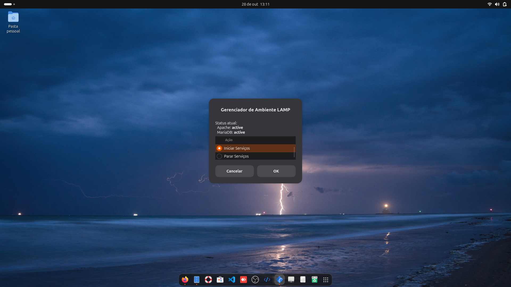
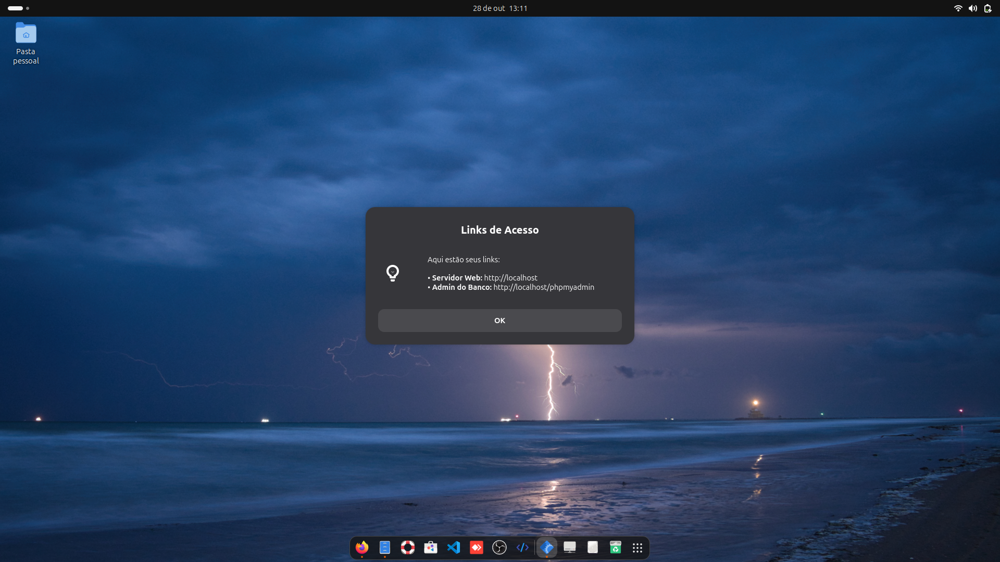

### Arquivo 1: `install.sh` (O Instalador Principal)

Este é o script que fará todo o trabalho pesado. Ele instala os programas, cria o gerenciador gráfico e baixa o gerenciador de arquivos.

Crie um arquivo chamado `install.sh` e cole este conteúdo nele:

```bash
#!/bin/bash

# --- Verificação de Root ---
if [ "$EUID" -ne 0 ]; then
  echo "Por favor, execute este script como root (com sudo)"
  exit 1
fi

echo "--- Iniciando a instalação do Ambiente LAMP para Ubuntu/Debian ---"

# --- Passo 1: Atualizar e Instalar Pacotes ---
echo "Atualizando pacotes..."
apt update

echo "Instalando Apache, MariaDB, PHP, Zenity e extensões..."
# Instala tudo de uma vez
apt install -y apache2 mariadb-server php libapache2-mod-php php-mysql \
               php-gd php-curl php-xml php-mbstring \
               zenity wget unzip

echo "Instalando PhpMyAdmin..."
# Força a reconfiguração para garantir que o Apache seja selecionado
echo "------ [ATENÇÃO] ------"
echo "Você precisará interagir com a instalação do PhpMyAdmin agora."
echo "1. Pressione 'OK'."
echo "2. Escolha 'Sim' para dbconfig-common (defina uma senha se pedir)."
echo "3. MAIS IMPORTANTE: Na tela 'Servidor web', pressione BARRA DE ESPAÇO para marcar 'apache2'."
echo "Pressione Enter para continuar..."
read # Pausa o script e espera o usuário pressionar Enter
dpkg-reconfigure phpmyadmin

# --- Passo 2: Criar o Script Gerenciador Gráfico ---
echo "Instalando script 'dev-lamp-manager'..."
# Usamos 'cat' para criar o arquivo diretamente no local correto
cat > /usr/local/bin/dev-lamp-manager << 'EOF'
#!/bin/bash

# 1. Obter o status atual dos serviços
STATUS_APACHE=$(systemctl is-active apache2)
STATUS_MARIADB=$(systemctl is-active mariadb)

# 2. Mostrar o menu principal com Zenity
ACTION=$(zenity --list --radiolist \
  --title="Gerenciador de Ambiente LAMP" \
  --text="Status atual:\n  Apache: <b>$STATUS_APACHE</b>\n  MariaDB: <b>$STATUS_MARIADB</b>" \
  --column="" --column="Ação" \
  TRUE "Iniciar Serviços" \
  FALSE "Parar Serviços" \
  FALSE "Ver Links de Acesso" \
  --height=270 --width=350)

# Se o usuário fechar a janela, $ACTION estará vazio
if [ -z "$ACTION" ]; then
    exit 0
fi

# 3. Executar a ação selecionada
case $ACTION in
  "Iniciar Serviços")
    (
    echo "10"
    echo "# Iniciando Apache2 (httpd)..."
    pkexec systemctl start apache2
    echo "50"
    echo "# Iniciando MariaDB (mysql)..."
    pkexec systemctl start mariadb
    echo "100"
    ) | zenity --progress --title="Iniciando" --text="Iniciando serviços..." --percentage=0 --auto-close --width=300
    
    zenity --info --width=300 --text="Serviços iniciados com sucesso!"
    ;;

  "Parar Serviços")
    (
    echo "10"
    echo "# Parando Apache2 (httpd)..."
    pkexec systemctl stop apache2
    echo "50"
    echo "# Parando MariaDB (mysql)..."
    pkexec systemctl stop mariadb
    echo "100"
    ) | zenity --progress --title="Parando" --text="Parando serviços..." --percentage=0 --auto-close --width=300

    zenity --info --width=300 --text="Serviços parados com sucesso!"
    ;;

  "Ver Links de Acesso")
    zenity --info --title="Links de Acesso" --width=400 \
    --text="Aqui estão seus links:\n\n• <b>Servidor Web:</b> http://localhost\n• <b>Admin do Banco:</b> http://localhost/phpmyadmin\n• <b>Gestor de Ficheiros:</b> http://localhost/filemanager.php"
    ;;
esac

exit 0
EOF

# Dar permissão de execução
chmod +x /usr/local/bin/dev-lamp-manager
echo "Script gerenciador instalado."

# --- Passo 3: Configurar Permissões do Apache ---
echo "Configurando permissões da pasta /var/www/html..."
# $SUDO_USER é o usuário que chamou o 'sudo', garantindo que o usuário certo seja adicionado
if [ -n "$SUDO_USER" ]; then
    usermod -a -G www-data $SUDO_USER
fi
chown -R www-data:www-data /var/www/html
chmod -R g+w /var/www/html

echo "Permissões configuradas."

# --- Passo 4: Instalar Gerenciador de Arquivos Simples ---
echo "Instalando Tiny File Manager..."
wget -O /var/www/html/filemanager.php https://raw.githubusercontent.com/prasathmani/tinyfilemanager/master/tinyfilemanager.php
chown www-data:www-data /var/www/html/filemanager.php

echo "--- INSTALAÇÃO QUASE CONCLUÍDA! ---"
echo ""
echo "Ações manuais obrigatórias:"
echo "1. SEGURANÇA DO BANCO: Execute 'sudo mysql_secure_installation' para definir uma senha root."
echo "2. LOGIN DO PHPMYADMIN: Para o root fazer login no PhpMyAdmin, execute:"
echo "   sudo mariadb -e \"ALTER USER 'root'@'localhost' IDENTIFIED WITH mysql_native_password BY 'SUA_SENHA_AQUI';\""
echo "   (Troque 'SUA_SENHA_AQUI' pela senha que você definiu no passo 1)"
echo "3. SENHA DO GERENCIADOR: Edite o arquivo '/var/www/html/filemanager.php' e configure uma senha segura (procure por \$auth_users)."
echo "4. ÍCONE DO LANÇADOR: O script não instala o ícone gráfico. Veja o README.md para instruções."
echo "5. REINICIE: Você precisa SAIR DA SESSÃO (Logout/Login) para que as permissões do grupo www-data tenham efeito."
echo ""
echo "Fim."
```

-----

### Arquivo 2: `README.md` (As Instruções)

Este é o manual do seu projeto. É a primeira coisa que as pessoas (incluindo você) verão.

Crie um arquivo chamado `README.md` e cole este conteúdo:

````markdown
# Ambiente de Desenvolvimento LAMP para Ubuntu/Debian

Scripts e instruções para configurar um ambiente de desenvolvimento web completo (Apache, MariaDB, PHP) em uma instalação do Ubuntu (ou derivados do Debian).

O setup inclui um gerenciador de serviços gráfico (com ícone), PhpMyAdmin, e um gerenciador de arquivos leve acessível pelo navegador.

## Instalação Rápida (Automática)

1.  **Clone o repositório:**
    ```bash
    git clone [https://github.com/SEU_USUARIO/SEU_REPOSITORIO.git](https://github.com/SEU_USUARIO/SEU_REPOSITORIO.git)
    cd SEU_REPOSITORIO
    ```

2.  **Torne o script de instalação executável:**
    ```bash
    chmod +x install.sh
    ```

3.  **Execute o script com `sudo`:**
    ```bash
    sudo ./install.sh
    ```

4.  **Siga as instruções interativas:**
    * O script irá pausar para você configurar o **PhpMyAdmin**. Lembre-se de marcar `apache2` com a **Barra de Espaço**.

## Ações Manuais Pós-Instalação

O script automatiza muito, mas por segurança, algumas etapas críticas devem ser feitas por você:

### 1. Proteger o MariaDB (Definir Senha Root)

Execute o assistente de segurança para definir sua senha de root do banco de dados:

```bash
sudo mysql_secure_installation
````

### 2\. Permitir Login Root no PhpMyAdmin

Por padrão, o root não pode logar no PhpMyAdmin. Corrija isso (substitua `SUA_SENHA_AQUI` pela senha que você acabou de criar no passo 1):

```bash
sudo mariadb -e "ALTER USER 'root'@'localhost' IDENTIFIED WITH mysql_native_password BY 'SUA_SENHA_AQUI';"
```

### 3\. Configurar Senha do Gerenciador de Arquivos

Por segurança, o gerenciador de arquivos precisa que você defina uma senha manualmente.

1.  Edite o arquivo:
    ```bash
    sudo nano /var/www/html/filemanager.php
    ```
2.  Procure pela linha (perto do topo) que começa com `// $auth_users`.
3.  Descomente (apague o `//`) das linhas `$auth_users` e `'admin'`.
4.  Gere uma nova senha. Abra **outro terminal** e execute (troque `SENHA_FORTE`):
    ```bash
    php -r "echo password_hash('SENHA_FORTE', PASSWORD_DEFAULT);"
    ```
5.  Copie o resultado (`$2y$10...`) e cole no arquivo `filemanager.php`, substituindo o hash da senha de 'admin'.
6.  Salve (`Ctrl+O`) e Saia (`Ctrl+X`).

### 4. Criar o Lançador Gráfico (Ícone)

O script `install.sh` instala o *programa* do gerenciador (`dev-lamp-manager`), mas o ícone que aparece no menu de aplicativos deve ser criado manualmente por você.

Você tem 3 opções para o ícone. Escolha **uma**:

---
**Opção A: Usar o Ícone deste Repositório (Recomendado)**

Este método usa o arquivo `dev_icon.png` que está incluído neste repositório.

1.  Primeiro, copie o ícone para a pasta de ícones do seu sistema:
    ```bash
    # Cria a pasta de ícones se ela não existir
    mkdir -p ~/.local/share/icons
    
    # Copia o ícone (execute este comando de dentro da pasta do repositório)
    cp dev_icon.png ~/.local/share/icons/
    ```

2.  Agora, crie o arquivo de lançador (`.desktop`) que aponta para ele.
    *(**Atenção:** Substitua `SEU_USUARIO` pelo seu nome de usuário. Se não souber, digite `whoami` no terminal para descobrir)*.
    ```bash
    tee ~/.local/share/applications/dev-lamp.desktop > /dev/null << EOF
[Desktop Entry]
Version=1.0
Name=Ambiente LAMP
Comment=Gerenciar servidor Apache e MariaDB
Exec=/usr/local/bin/dev-lamp-manager
Icon=/home/SEU_USUARIO/.local/share/icons/dev_icon.png
Terminal=false
Type=Application
Categories=Development;
EOF
    ```
---
**Opção B: Usar um Ícone Personalizado (Que você baixou)**

Se você preferir baixar seu próprio ícone da internet.

1.  Suponha que você baixou um ícone chamado `meu-icone.png` e ele está na sua pasta `Downloads`.
2.  Copie seu ícone para a pasta de ícones do sistema:
    ```bash
    mkdir -p ~/.local/share/icons
    cp ~/Downloads/meu-icone.png ~/.local/share/icons/
    ```

3.  Crie o arquivo de lançador apontando para o *seu* ícone.
    *(**Atenção:** Substitua `SEU_USUARIO` e `meu-icone.png` pelos seus nomes corretos)*.
    ```bash
    tee ~/.local/share/applications/dev-lamp.desktop > /dev/null << EOF
[Desktop Entry]
Version=1.0
Name=Ambiente LAMP
Comment=Gerenciar servidor Apache e MariaDB
Exec=/usr/local/bin/dev-lamp-manager
Icon=/home/SEU_USUARIO/.local/share/icons/meu-icone.png
Terminal=false
Type=Application
Categories=Development;
EOF
    ```
---
**Opção C: Usar um Ícone Padrão do Sistema (O mais simples)**

Se não quiser se preocupar com arquivos de imagem, apenas use um ícone genérico que já vem no Ubuntu.

1.  Execute este comando para criar o lançador:
    ```bash
    tee ~/.local/share/applications/dev-lamp.desktop > /dev/null << EOF
[Desktop Entry]
Version=1.0
Name=Ambiente LAMP
Comment=Gerenciar servidor Apache e MariaDB
Exec=/usr/local/bin/dev-lamp-manager
Icon=applications-development
Terminal=false
Type=Application
Categories=Development;
EOF
    ```

### 5\. Fazer Logout e Login

**MUITO IMPORTANTE:** Você deve fazer **logout** e **login** novamente na sua sessão do Ubuntu. Isso é necessário para que as permissões da pasta `/var/www/html` funcionem para o seu usuário.

## Como Usar

Após o login:

  * **Gerenciador Gráfico:** Procure por "Ambiente LAMP" no seu menu de aplicativos.
  * **Servidor Web:** `http://localhost`
  * **Banco de Dados:** `http://localhost/phpmyadmin`
  * **Arquivos:** `http://localhost/filemanager.php`

<!-- end list -->

```

---

### Arquivo 3: `dev_icon.png`

Adicione o arquivo `dev_icon.png` que você baixou na mesma pasta dos outros arquivos. O `README.md` já ensina o usuário a copiá-lo para o lugar certo.

### O que fazer agora:

1.  Crie um **novo repositório** na sua conta do GitHub (ex: `ubuntu-lamp-ambiente`).
2.  No seu computador, crie uma pasta com esse mesmo nome.
3.  Dentro dela, coloque os 3 arquivos:
    * `install.sh` (que você copiou daqui)
    * `README.md` (que você copiou daqui)
    * `dev_icon.png` (o ícone que você já tem)
4.  Siga as instruções do GitHub para fazer o "push" (envio) desses arquivos para o seu repositório.

E pronto! Você terá seu segundo projeto de ambiente de desenvolvimento no GitHub.
```
